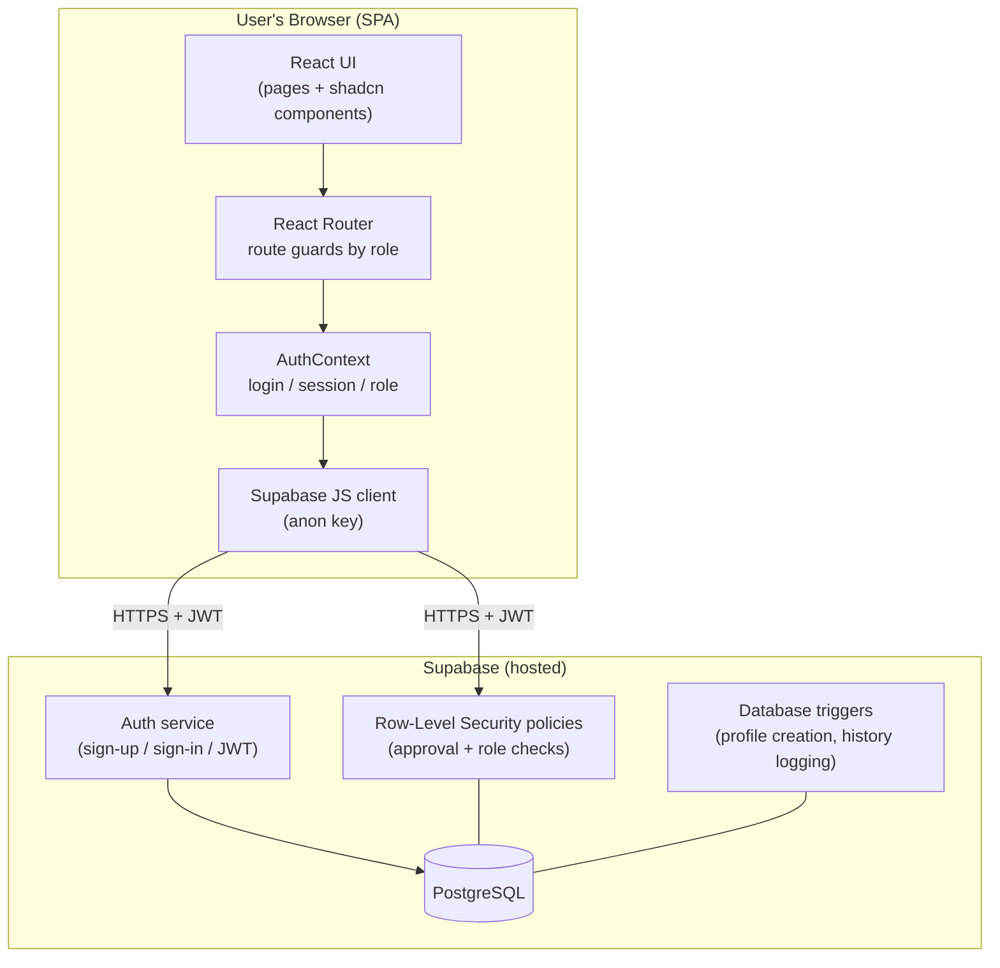
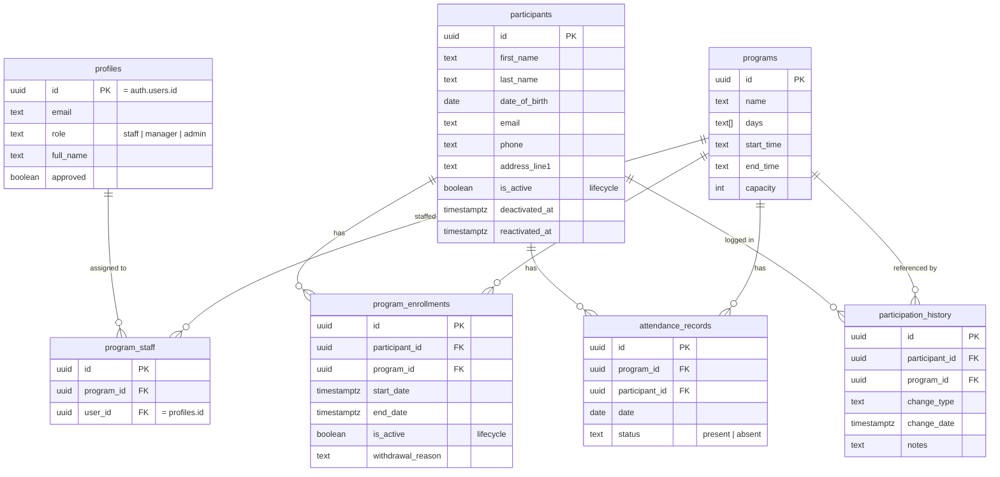
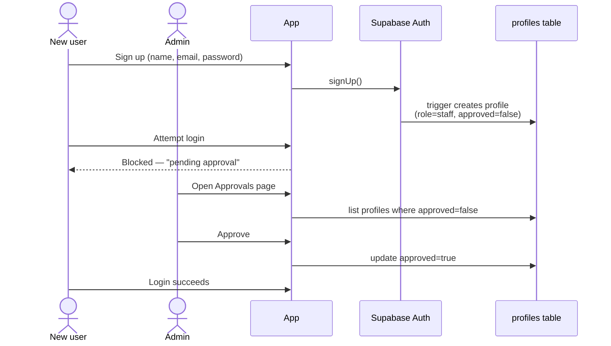
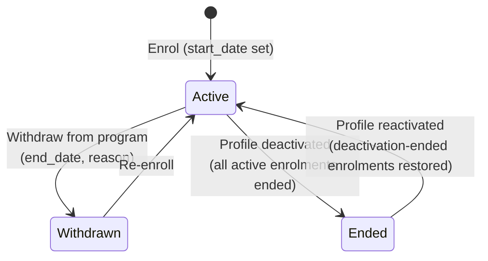
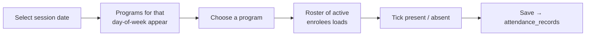

# Design Document — The Hut Participation Portal

## 1. Overview

The Hut Participation Portal is a web application for a South Australian community
organisation to manage program participants, enrol them in programs, and record
attendance. It replaces paper/spreadsheet processes with a role-based system that
keeps participant records, enrolment history, and attendance in one place.

The application is a **single-page application (SPA)**: there is no custom backend
server. The browser talks directly to **Supabase** (a hosted PostgreSQL database
with built-in authentication and row-level security), which is the system's data
store, authentication provider, and security boundary.

## 2. Technology Stack

| Layer | Technology | Purpose |
|-------|-----------|---------|
| UI framework | React 18 + TypeScript | Component-based interface, type safety |
| Build tool | Vite 6 | Dev server + production bundling |
| Routing | React Router 7 (data router) | Client-side navigation & route guards |
| Styling | Tailwind CSS v4 | Utility-first styling |
| UI components | shadcn/ui (Radix UI primitives) | Accessible dialogs, selects, etc. |
| Backend-as-a-service | Supabase (PostgreSQL, Auth, RLS) | Database, authentication, authorisation |
| Charts | Recharts | Reporting visualisations |

Full version and licence details are in [REFERENCES.md](REFERENCES.md).

## 3. System Architecture



**Key point:** because the browser holds only the public *anon key*, the database's
Row-Level Security (RLS) policies — not the UI — are what actually enforce who can
read or change data. The UI's role checks are a usability layer on top.

## 4. Data Model



A `UNIQUE(participant_id, program_id)` constraint on `program_enrollments` means a
participant has at most one enrolment row per program; re-joining a program reuses
that row rather than creating a duplicate (see §6.3).

## 5. Roles & Access Control

The system has a **3-tier role model**. Access widens from Staff → Manager → Admin.

| Capability | Staff | Manager | Admin |
|-----------|:----:|:------:|:----:|
| Mark attendance (assigned programs only for staff) | ✅ | ✅ | ✅ |
| View training | ✅ | ✅ | ✅ |
| Register participants / enrol in programs | ❌ | ✅ | ✅ |
| Search participants / view profiles | ❌ | ✅* | ✅ |
| Manage programs & assign staff | ❌ | ❌ | ✅ |
| View reports | ❌ | ❌ | ✅ |
| Approve / deny new user sign-ups | ❌ | ❌ | ✅ |

\* Managers can open participant profiles they enrol into; full participant search is admin-only.

Access is enforced in **two layers**:
1. **Database (authoritative):** RLS policies check that the caller is an *approved*
   user with the required role before any read/write (see [security-fixes.sql](../security-fixes.sql)).
2. **Application (usability):** the sidebar hides links and route guards redirect
   unauthorised users (`ProtectedRoute roles={...}` in `routes.tsx`).

## 6. Core Workflows

### 6.1 Sign-up and approval



New accounts are always created as **unapproved Staff**. An administrator reviews
and approves them; only then can they log in. Higher roles are assigned manually in
the database, never self-selected (a security decision — see §7).

### 6.2 Register a participant and enrol in a program

A Manager/Admin registers a participant (multi-step form capturing personal,
cultural, emergency-contact and program-specific details), then enrols them in a
program via *Add to Program*, choosing an enrolment date.

### 6.3 Participation lifecycle (enrol / withdraw / deactivate / reactivate)

Rather than deleting records (which would lose history), the system uses a
**soft-delete lifecycle**. Enrolments and participant profiles carry an `is_active`
flag; changes are timestamped and logged to `participation_history` automatically by
database triggers.



This preserves a full audit trail: who was enrolled when, why they left, and when
they returned.

### 6.4 Mark attendance



Staff see only the programs they are assigned to (`program_staff`); managers and
admins see all programs.

## 7. Significant Decisions

| Decision | Rationale |
|---------|-----------|
| **No custom backend; client + Supabase RLS** | Faster to build; RLS gives database-level security without a server to maintain. |
| **RLS is the security boundary, not the UI** | The anon key is public (it ships in the browser bundle); data is safe only because RLS restricts every query. |
| **Soft-delete lifecycle instead of hard delete** | Community programs need historical reporting (who attended, withdrawals, re-enrolments); deleting rows would destroy that. |
| **Role assigned server-side, never from sign-up input** | Prevents a user from registering themselves as an admin via the public API. |
| **Approval gate for new accounts** | Staff handle vulnerable participants' data; accounts must be vetted before access. |
| **Dates normalised to noon UTC before storing** | A bare `YYYY-MM-DD` can shift by a day across timezones; noon UTC avoids off-by-one errors. |
| **Schema-resilient insert/update (retry stripping unknown columns)** | The schema evolved over time; this lets the app run against databases that haven't had every migration applied yet. |

## 8. Assumptions

- The organisation operates in South Australia (reference data: SA council regions,
  Adelaide Hills townships).
- Supabase email confirmation is **disabled**, so the custom approval gate governs
  access instead.
- The **first administrator** is approved/elevated manually in the Supabase dashboard.
- A single Supabase project backs the app; credentials live in
  `src/config/supabase.config.ts`.
- The published anon key is safe to expose **provided** the RLS policies in
  `security-fixes.sql` are applied.

## 9. Database Setup Order

Scripts must be run in the Supabase SQL Editor in this order (all idempotent):

1. `supabase-setup.sql` — tables, base policies, sign-up trigger.
2. `historical-participation-tracking.sql` — lifecycle columns, `participation_history`, logging triggers.
3. `security-fixes.sql` — hardened RLS and sign-up trigger (see [REPORT.md](REPORT.md) §Security).

## 10. Repository Map (high level)

```
src/
  main.tsx                 App bootstrap
  app/
    App.tsx                RouterProvider
    routes.tsx             Route table + role guards
    context/AuthContext    Auth state & role
    components/Layout      Sidebar/topbar + nav by role
    components/ui/         shadcn/ui primitives
    pages/                 One file per screen
    utils/constants.ts     SA reference data
  lib/supabase.ts          Supabase client + DB types
  config/supabase.config   Project URL + anon key
*.sql                      Database setup & migrations
docs/                      This documentation
```
